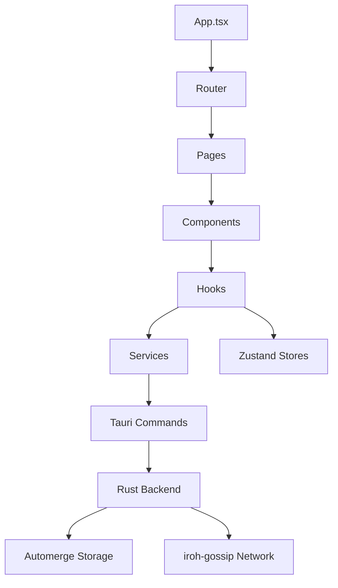

## 目次
1. [プロジェクト概要](#1-プロジェクト概要)
2. [開発環境設定](#2-開発環境設定)
3. [アプリケーション構造](#3-アプリケーション構造)
4. [技術実装詳細](#4-技術実装詳細)
5. [データモデル設計](#5-データモデル設計)
6. [テスト戦略](#6-テスト戦略)
7. [CI/CD パイプライン](#7-cicd-パイプライン)
8. [実装ロードマップ](#8-実装ロードマップ)
9. [.clinerulesファイル](#9-clinerulesファイル)

## 1. プロジェクト概要

分散型ソーシャルネットワークアプリケーションのPhase 1（MVP）を実装するための詳細設計書です。この実装は、Tauri、iroh-gossip、Automergeなどの技術を使用して、分散型のソーシャルネットワークの基本機能を提供します。MVPでは以下の機能を実装します：

- ユーザープロフィール作成と管理
- 短文テキスト投稿とタイムライン表示
- 基本的なフォロー/フォロワー機能
- シンプルな投稿検索（ローカルのみ）
- 基本的なP2P通信（iroh-gossip使用）
- ローカルデータの保存と同期（Automerge使用）

## 2. 開発環境設定

### 2.1 必要なツール・ライブラリ

```bash
# Rustツールチェーン
curl --proto '=https' --tlsv1.2 -sSf https://sh.rustup.rs | sh
rustup default stable
rustup target add wasm32-unknown-unknown

# Node.js (v18以上推奨)
# nvm経由での設定例
curl -o- https://raw.githubusercontent.com/nvm-sh/nvm/v0.39.7/install.sh | bash
nvm install 18
nvm use 18

# Tauriの依存関係（Ubuntu/Debian系）
sudo apt update
sudo apt install libwebkit2gtk-4.0-dev \\
    build-essential \\
    curl \\
    wget \\
    libssl-dev \\
    libgtk-3-dev \\
    libayatana-appindicator3-dev \\
    librsvg2-dev

# macOS依存関係
xcode-select --install

# Windows依存関係
# WebViewインストーラーをダウンロードして実行
# https://developer.microsoft.com/en-us/microsoft-edge/webview2/
```

### 2.2 プロジェクト初期化

```bash
# ディレクトリ作成
mkdir decentralized-social-app
cd decentralized-social-app

# Tauriプロジェクト初期化
npm create tauri-app@latest .
# Vite + Reactを選択
# TypeScriptを選択

# 必要な依存関係のインストール
npm install zustand @tanstack/react-query react-router-dom zod
npm install @tauri-apps/api automerge iroh-gossip

# 開発ツールのインストール
npm install -D tailwindcss postcss autoprefixer shadcn-ui vitest
npx tailwindcss init -p
npx shadcn-ui init
```

## 3. アプリケーション構造

### 3.1 ディレクトリ構造

```
decentralized-social-app/
├── .github/                      # GitHub Actions設定
│   └── workflows/                # CI/CDワークフロー定義
├── src/                          # Reactアプリケーションのソースコード
│   ├── assets/                   # 静的アセット
│   ├── components/               # UIコンポーネント
│   │   ├── ui/                   # shadcn/uiコンポーネント
│   │   ├── auth/                 # 認証関連コンポーネント
│   │   ├── post/                 # 投稿関連コンポーネント
│   │   ├── profile/              # プロフィール関連コンポーネント
│   │   └── layout/               # レイアウトコンポーネント
│   ├── hooks/                    # カスタムReactフック
│   │   ├── use-auth.ts           # 認証フック
│   │   ├── use-posts.ts          # 投稿関連フック
│   │   └── use-profile.ts        # プロフィール関連フック
│   ├── lib/                      # ユーティリティ関数とヘルパー
│   │   ├── utils.ts              # 一般ユーティリティ
│   │   ├── validators.ts         # zodバリデータ
│   │   └── constants.ts          # 定数
│   ├── models/                   # データモデル（zod型定義）
│   │   ├── user.ts               # ユーザーモデル
│   │   ├── post.ts               # 投稿モデル
│   │   └── settings.ts           # 設定モデル
│   ├── pages/                    # ページコンポーネント
│   │   ├── home/                 # ホームページ
│   │   ├── profile/              # プロフィールページ
│   │   ├── settings/             # 設定ページ
│   │   └── auth/                 # 認証ページ
│   ├── services/                 # サービス層
│   │   ├── auth-service.ts       # 認証サービス
│   │   ├── post-service.ts       # 投稿サービス
│   │   ├── profile-service.ts    # プロフィールサービス
│   │   └── storage-service.ts    # ストレージサービス
│   ├── stores/                   # Zustandストア
│   │   ├── auth-store.ts         # 認証状態
│   │   ├── post-store.ts         # 投稿状態
│   │   └── settings-store.ts     # 設定状態
│   ├── App.tsx                   # メインアプリケーションコンポーネント
│   ├── main.tsx                  # エントリーポイント
│   └── vite-env.d.ts             # Viteの型定義
├── src-tauri/                    # Tauriネイティブ部分
│   ├── src/                      # Rustコード
│   │   ├── main.rs               # メインエントリーポイント
│   │   ├── commands/             # Tauriコマンド
│   │   │   ├── mod.rs            # コマンドモジュール
│   │   │   ├── auth.rs           # 認証コマンド
│   │   │   ├── post.rs           # 投稿コマンド
│   │   │   └── settings.rs       # 設定コマンド
│   │   ├── storage/              # ストレージ関連
│   │   │   ├── mod.rs            # ストレージモジュール
│   │   │   └── automerge.rs      # Automerge実装
│   │   ├── network/              # ネットワーク関連
│   │   │   ├── mod.rs            # ネットワークモジュール
│   │   │   └── iroh.rs           # iroh-gossip実装
│   │   └── models/               # Rustデータモデル
│   │       ├── mod.rs            # モデルモジュール
│   │       ├── user.rs           # ユーザーモデル
│   │       └── post.rs           # 投稿モデル
│   ├── Cargo.toml                # Rust依存関係
│   └── tauri.conf.json           # Tauri設定
├── tests/                        # テストディレクトリ
│   ├── unit/                     # ユニットテスト
│   ├── integration/              # 統合テスト
│   └── e2e/                      # E2Eテスト
├── .clinerulesrules              # AIへの行動規範設定
├── .gitignore                    # Gitの無視ファイル
├── package.json                  # NPM依存関係
├── tailwind.config.js            # Tailwind設定
├── tsconfig.json                 # TypeScript設定
├── vite.config.ts                # Vite設定
└── README.md                     # プロジェクト説明
```

### 3.2 主要コンポーネントの関係



## 4. 技術実装詳細

### 4.1 Tauriコマンド定義

#### 4.1.1 認証コマンド

```rust
// src-tauri/src/commands/auth.rs
use crate::models::user::User;
use serde::{Deserialize, Serialize};
use tauri::command;
use uuid::Uuid;
use ring::signature::{self, KeyPair, Ed25519KeyPair};
use base64::{engine::general_purpose, Engine as _};

#[derive(Debug, Serialize, Deserialize)]
pub struct AuthResult {
    pub user_id: String,
    pub success: bool,
    pub message: Option<String>,
}

#[command]
pub async fn create_user(display_name: String, bio: Option<String>) -> Result<AuthResult, String> {
    // 1. 新しいキーペアを生成
    let rng = ring::rand::SystemRandom::new();
    let pkcs8_bytes = Ed25519KeyPair::generate_pkcs8(&rng)
        .map_err(|_| \"Failed to generate key pair\".to_string())?;
    
    let key_pair = Ed25519KeyPair::from_pkcs8(&pkcs8_bytes.as_ref())
        .map_err(|_| \"Failed to parse key pair\".to_string())?;
    
    // 2. 公開鍵からユーザーIDを作成
    let public_key = key_pair.public_key().as_ref();
    let public_key_b64 = general_purpose::STANDARD.encode(public_key);
    let user_id = Uuid::new_v4().to_string();
    
    // 3. ユーザープロファイルを作成して保存
    let user = User {
        id: user_id.clone(),
        display_name,
        bio: bio.unwrap_or_default(),
        public_key: public_key_b64,
        // その他のフィールドを初期化
        avatar: None,
        following: vec![],
        followers: vec![],
        created_at: chrono::Utc::now().timestamp(),
    };
    
    // StorageManagerを使用してユーザーを保存
    match crate::storage::automerge::save_user(&user) {
        Ok(_) => {
            // 4. 秘密鍵を安全に保存（Tauriのセキュアストレージを使用）
            let private_key_b64 = general_purpose::STANDARD.encode(pkcs8_bytes);
            match tauri::api::path::app_data_dir(&tauri::Config::default()) {
                Some(app_dir) => {
                    let key_dir = app_dir.join(\"keys\");
                    std::fs::create_dir_all(&key_dir)
                        .map_err(|e| format!(\"Failed to create key directory: {}\", e))?;
                    
                    let key_path = key_dir.join(format!(\"{}.key\", user_id));
                    std::fs::write(key_path, private_key_b64)
                        .map_err(|e| format!(\"Failed to save private key: {}\", e))?;
                    
                    Ok(AuthResult {
                        user_id,
                        success: true,
                        message: None,
                    })
                }
                None => Err(\"Failed to determine app data directory\".to_string()),
            }
        }
        Err(e) => Err(format!(\"Failed to save user profile: {}\", e)),
    }
}

#[command]
pub async fn sign_in(user_id: String) -> Result<AuthResult, String> {
    // ユーザーIDに基づいて秘密鍵を読み込み
    match tauri::api::path::app_data_dir(&tauri::Config::default()) {
        Some(app_dir) => {
            let key_path = app_dir.join(\"keys\").join(format!(\"{}.key\", user_id));
            match std::fs::read(key_path) {
                Ok(key_data) => {
                    // ユーザープロファイルを取得して検証
                    match crate::storage::automerge::get_user(&user_id) {
                        Ok(Some(user)) => {
                            Ok(AuthResult {
                                user_id,
                                success: true,
                                message: None,
                            })
                        }
                        Ok(None) => Err(\"User profile not found\".to_string()),
                        Err(e) => Err(format!(\"Failed to retrieve user profile: {}\", e)),
                    }
                }
                Err(_) => Err(\"User credentials not found\".to_string()),
            }
        }
        None => Err(\"Failed to determine app data directory\".to_string()),
    }
}
```

#### 4.1.2 投稿コマンド

```rust
// src-tauri/src/commands/post.rs
use crate::models::post::Post;
use serde::{Deserialize, Serialize};
use tauri::command;
use uuid::Uuid;
use chrono::Utc;

#[derive(Debug, Serialize, Deserialize)]
pub struct PostResult {
    pub post_id: String,
    pub success: bool,
    pub message: Option<String>,
}

#[command]
pub async fn create_post(author_id: String, content: String) -> Result<PostResult, String> {
    // 1. 投稿IDを生成
    let post_id = Uuid::new_v4().to_string();
    
    // 2. 投稿を作成
    let post = Post {
        id: post_id.clone(),
        author_id,
        content,
        attachments: vec![],
        mentions: vec![],
        hashtags: vec![],
        created_at: Utc::now().timestamp(),
    };
    
    // 3. 投稿を保存
    match crate::storage::automerge::save_post(&post) {
        Ok(_) => {
            // 4. iroh-gossipで投稿を発信
            match crate::network::iroh::publish_post(&post) {
                Ok(_) => Ok(PostResult {
                    post_id,
                    success: true,
                    message: None,
                }),
                Err(e) => {
                    // ネットワーク発信に失敗しても投稿は保存されている
                    Ok(PostResult {
                        post_id,
                        success: true,
                        message: Some(format!(\"Post created but failed to publish: {}\", e)),
                    })
                }
            }
        }
        Err(e) => Err(format!(\"Failed to save post: {}\", e)),
    }
}

#[command]
pub async fn get_posts(limit: Option<usize>, offset: Option<usize>) -> Result<Vec<Post>, String> {
    let limit = limit.unwrap_or(20);
    let offset = offset.unwrap_or(0);
    
    crate::storage::automerge::get_posts(limit, offset)
        .map_err(|e| format!(\"Failed to retrieve posts: {}\", e))
}

#[command]
pub async fn get_user_posts(user_id: String, limit: Option<usize>, offset: Option<usize>) -> Result<Vec<Post>, String> {
    let limit = limit.unwrap_or(20);
    let offset = offset.unwrap_or(0);
    
    crate::storage::automerge::get_user_posts(&user_id, limit, offset)
        .map_err(|e| format!(\"Failed to retrieve user posts: {}\", e))
}

#[command]
pub async fn search_posts(query: String, limit: Option<usize>) -> Result<Vec<Post>, String> {
    let limit = limit.unwrap_or(50);
    
    // ローカルの投稿からの簡易検索
    crate::storage::automerge::search_posts(&query, limit)
        .map_err(|e| format!(\"Failed to search posts: {}\", e))
}
```

#### 4.1.3 プロフィールコマンド

```rust
// src-tauri/src/commands/profile.rs
use crate::models::user::User;
use serde::{Deserialize, Serialize};
use tauri::command;

#[derive(Debug, Serialize, Deserialize)]
pub struct ProfileUpdateResult {
    pub success: bool,
    pub message: Option<String>,
}

#[command]
pub async fn get_profile(user_id: String) -> Result<Option<User>, String> {
    crate::storage::automerge::get_user(&user_id)
        .map_err(|e| format!(\"Failed to retrieve user profile: {}\", e))
}

#[command]
pub async fn update_profile(
    user_id: String, 
    display_name: Option<String>, 
    bio: Option<String>,
    avatar: Option<String>
) -> Result<ProfileUpdateResult, String> {
    // 1. 既存のプロフィールを取得
    match crate::storage::automerge::get_user(&user_id) {
        Ok(Some(mut user)) => {
            // 2. 提供されたフィールドを更新
            if let Some(display_name) = display_name {
                user.display_name = display_name;
            }
            
            if let Some(bio) = bio {
                user.bio = bio;
            }
            
            if let Some(avatar) = avatar {
                user.avatar = Some(avatar);
            }
            
            // 3. 更新されたプロフィールを保存
            match crate::storage::automerge::save_user(&user) {
                Ok(_) => {
                    // 4. iroh-gossipでプロフィール更新を発信
                    match crate::network::iroh::publish_profile(&user) {
                        Ok(_) => Ok(ProfileUpdateResult {
                            success: true,
                            message: None,
                        }),
                        Err(e) => {
                            // ネットワーク発信に失敗してもプロフィールは更新されている
                            Ok(ProfileUpdateResult {
                                success: true,
                                message: Some(format!(\"Profile updated but failed to publish: {}\", e)),
                            })
                        }
                    }
                }
                Err(e) => Err(format!(\"Failed to save updated profile: {}\", e)),
            }
        }
        Ok(None) => Err(\"User profile not found\".to_string()),
        Err(e) => Err(format!(\"Failed to retrieve user profile: {}\", e)),
    }
}

#[command]
pub async fn follow_user(user_id: String, target_user_id: String) -> Result<ProfileUpdateResult, String> {
    // 1. 現在のユーザープロフィールを取得
    match crate::storage::automerge::get_user(&user_id) {
        Ok(Some(mut user)) => {
            // 2. フォローリストに追加（重複確認）
            if !user.following.contains(&target_user_id) {
                user.following.push(target_user_id.clone());
                
                // 3. 更新されたプロフィールを保存
                match crate::storage::automerge::save_user(&user) {
                    Ok(_) => {
                        // 4. フォロー関係を発信
                        match crate::network::iroh::publish_follow(&user_id, &target_user_id) {
                            Ok(_) => Ok(ProfileUpdateResult {
                                success: true,
                                message: None,
                            }),
                            Err(e) => {
                                Ok(ProfileUpdateResult {
                                    success: true,
                                    message: Some(format!(\"Follow successful but failed to publish: {}\", e)),
                                })
                            }
                        }
                    }
                    Err(e) => Err(format!(\"Failed to save follow relationship: {}\", e)),
                }
            } else {
                // 既にフォロー済み
                Ok(ProfileUpdateResult {
                    success: true,
                    message: Some(\"Already following this user\".to_string()),
                })
            }
        }
        Ok(None) => Err(\"User profile not found\".to_string()),
        Err(e) => Err(format!(\"Failed to retrieve user profile: {}\", e)),
    }
}

#[command]
pub async fn unfollow_user(user_id: String, target_user_id: String) -> Result<ProfileUpdateResult, String> {
    // フォロー解除の実装（followの逆操作）
    match crate::storage::automerge::get_user(&user_id) {
        Ok(Some(mut user)) => {
            user.following.retain(|id| id != &target_user_id);
            
            match crate::storage::automerge::save_user(&user) {
                Ok(_) => {
                    match crate::network::iroh::publish_unfollow(&user_id, &target_user_id) {
                        Ok(_) => Ok(ProfileUpdateResult {
                            success: true,
                            message: None,
                        }),
                        Err(e) => {
                            Ok(ProfileUpdateResult {
                                success: true,
                                message: Some(format!(\"Unfollow successful but failed to publish: {}\", e)),
                            })
                        }
                    }
                }
                Err(e) => Err(format!(\"Failed to save unfollow relationship: {}\", e)),
            }
        }
        Ok(None) => Err(\"User profile not found\".to_string()),
        Err(e) => Err(format!(\"Failed to retrieve user profile: {}\", e)),
    }
}
```

### 4.2 Automerge実装

```rust
// src-tauri/src/storage/automerge.rs
use automerge::{Automerge, transaction::Transactable};
use std::fs::{self, File};
use std::io::{Read, Write};
use std::path::PathBuf;
use std::sync::Mutex;
use once_cell::sync::Lazy;
use serde::{Deserialize, Serialize};
use tauri::api::path;

use crate::models::user::User;
use crate::models::post::Post;

// グローバルなAutomergeドキュメント
static DOCUMENT: Lazy<Mutex<Automerge>> = Lazy::new(|| {
    Mutex::new(load_or_create_document().unwrap_or_else(|_| {
        let mut doc = Automerge::new();
        initialize_document(&mut doc).unwrap();
        doc
    }))
});

// データファイルのパス
fn get_data_file_path() -> Result<PathBuf, String> {
    let app_dir = path::app_data_dir(&tauri::Config::default())
        .ok_or_else(|| \"Failed to get app data directory\".to_string())?;
    
    let data_dir = app_dir.join(\"data\");
    fs::create_dir_all(&data_dir)
        .map_err(|e| format!(\"Failed to create data directory: {}\", e))?;
    
    Ok(data_dir.join(\"social_data.automerge\"))
}

// ドキュメントの読み込みまたは新規作成
fn load_or_create_document() -> Result<Automerge, String> {
    let file_path = get_data_file_path()?;
    
    if file_path.exists() {
        let mut file = File::open(&file_path)
            .map_err(|e| format!(\"Failed to open data file: {}\", e))?;
        
        let mut bytes = Vec::new();
        file.read_to_end(&mut bytes)
            .map_err(|e| format!(\"Failed to read data file: {}\", e))?;
        
        Automerge::load(&bytes)
            .map_err(|e| format!(\"Failed to parse Automerge document: {}\", e))
    } else {
        let mut doc = Automerge::new();
        initialize_document(&mut doc)?;
        save_document(&doc)?;
        Ok(doc)
    }
}

// ドキュメントの初期構造を設定
fn initialize_document(doc: &mut Automerge) -> Result<(), String> {
    let mut tx = doc.transaction();
    
    // ルートオブジェクトにコレクションを作成
    tx.put_object(automerge::ROOT, \"users\", automerge::ObjType::Map)
        .map_err(|e| format!(\"Failed to create users collection: {}\", e))?;
    
    tx.put_object(automerge::ROOT, \"posts\", automerge::ObjType::Map)
        .map_err(|e| format!(\"Failed to create posts collection: {}\", e))?;
    
    tx.put_object(automerge::ROOT, \"settings\", automerge::ObjType::Map)
        .map_err(|e| format!(\"Failed to create settings collection: {}\", e))?;
    
    tx.commit();
    Ok(())
}

// ドキュメントの保存
fn save_document(doc: &Automerge) -> Result<(), String> {
    let file_path = get_data_file_path()?;
    
    let bytes = doc.save();
    let mut file = File::create(&file_path)
        .map_err(|e| format!(\"Failed to create data file: {}\", e))?;
    
    file.write_all(&bytes)
        .map_err(|e| format!(\"Failed to write data file: {}\", e))?;
    
    Ok(())
}

// ユーザー保存
pub fn save_user(user: &User) -> Result<(), String> {
    let mut doc = DOCUMENT.lock().unwrap();
    let mut tx = doc.transaction();
    
    // ユーザーJSONにシリアライズ
    let user_json = serde_json::to_string(user)
        .map_err(|e| format!(\"Failed to serialize user: {}\", e))?;
    
    // users/{user_id}にユーザー情報を保存
    let users_obj = tx.get(automerge::ROOT, \"users\")
        .map_err(|e| format!(\"Failed to get users collection: {}\", e))?
        .expect(\"users collection should exist\");
    
    tx.put(users_obj, &user.id, user_json)
        .map_err(|e| format!(\"Failed to save user: {}\", e))?;
    
    tx.commit();
    
    // ドキュメントをディスクに保存
    save_document(&doc)
}

// ユーザー取得
pub fn get_user(user_id: &str) -> Result<Option<User>, String> {
    let doc = DOCUMENT.lock().unwrap();
    
    let users_obj = doc.get(automerge::ROOT, \"users\")
        .map_err(|e| format!(\"Failed to get users collection: {}\", e))?
        .expect(\"users collection should exist\");
    
    match doc.get(users_obj, user_id) {
        Ok(Some(automerge::Value::Text(user_json))) => {
            serde_json::from_str(&user_json)
                .map_err(|e| format!(\"Failed to deserialize user: {}\", e))
                .map(Some)
        }
        Ok(None) => Ok(None),
        Ok(Some(_)) => Err(\"Invalid user data format\".to_string()),
        Err(e) => Err(format!(\"Failed to get user: {}\", e)),
    }
}

// 投稿保存
pub fn save_post(post: &Post) -> Result<(), String> {
    let mut doc = DOCUMENT.lock().unwrap();
    let mut tx = doc.transaction();
    
    // 投稿JSONにシリアライズ
    let post_json = serde_json::to_string(post)
        .map_err(|e| format!(\"Failed to serialize post: {}\", e))?;
    
    // posts/{post_id}に投稿情報を保存
    let posts_obj = tx.get(automerge::ROOT, \"posts\")
        .map_err(|e| format!(\"Failed to get posts collection: {}\", e))?
        .expect(\"posts collection should exist\");
    
    tx.put(posts_obj, &post.id, post_json)
        .map_err(|e| format!(\"Failed to save post: {}\", e))?;
    
    tx.commit();
    
    // ドキュメントをディスクに保存
    save_document(&doc)
}

// 投稿取得（ページネーション付き）
pub fn get_posts(limit: usize, offset: usize) -> Result<Vec<Post>, String> {
    let doc = DOCUMENT.lock().unwrap();
    
    let posts_obj = doc.get(automerge::ROOT, \"posts\")
        .map_err(|e| format!(\"Failed to get posts collection: {}\", e))?
        .expect(\"posts collection should exist\");
    
    let mut posts = Vec::new();
    
    // すべての投稿キー`
}
{
  `path`: `C:\\Users\\kgm11\\mcp_filesystem\\blueprint.md`,
  `content`: `// 投稿取得（ページネーション付き）
pub fn get_posts(limit: usize, offset: usize) -> Result<Vec<Post>, String> {
    let doc = DOCUMENT.lock().unwrap();
    
    let posts_obj = doc.get(automerge::ROOT, \"posts\")
        .map_err(|e| format!(\"Failed to get posts collection: {}\", e))?
        .expect(\"posts collection should exist\");
    
    let mut posts = Vec::new();
    
    // すべての投稿キーを取得
    let keys = doc.keys(posts_obj)
        .map_err(|e| format!(\"Failed to get post keys: {}\", e))?;
    
    // タイムスタンプでソートするためのデータを収集
    let mut post_data = Vec::new();
    for key in keys {
        if let Ok(Some(automerge::Value::Text(post_json))) = doc.get(posts_obj, &key) {
            if let Ok(post) = serde_json::from_str::<Post>(&post_json) {
                post_data.push(post);
            }
        }
    }
    
    // 作成日時の降順でソート
    post_data.sort_by(|a, b| b.created_at.cmp(&a.created_at));
    
    // ページネーション適用
    let end = std::cmp::min(offset + limit, post_data.len());
    if offset < end {
        posts = post_data[offset..end].to_vec();
    }
    
    Ok(posts)
}

// 特定ユーザーの投稿取得（ページネーション付き）
pub fn get_user_posts(user_id: &str, limit: usize, offset: usize) -> Result<Vec<Post>, String> {
    let doc = DOCUMENT.lock().unwrap();
    
    let posts_obj = doc.get(automerge::ROOT, \"posts\")
        .map_err(|e| format!(\"Failed to get posts collection: {}\", e))?
        .expect(\"posts collection should exist\");
    
    let mut posts = Vec::new();
    
    // すべての投稿キーを取得
    let keys = doc.keys(posts_obj)
        .map_err(|e| format!(\"Failed to get post keys: {}\", e))?;
    
    // ユーザーIDに一致する投稿を収集
    let mut user_posts = Vec::new();
    for key in keys {
        if let Ok(Some(automerge::Value::Text(post_json))) = doc.get(posts_obj, &key) {
            if let Ok(post) = serde_json::from_str::<Post>(&post_json) {
                if post.author_id == user_id {
                    user_posts.push(post);
                }
            }
        }
    }
    
    // 作成日時の降順でソート
    user_posts.sort_by(|a, b| b.created_at.cmp(&a.created_at));
    
    // ページネーション適用
    let end = std::cmp::min(offset + limit, user_posts.len());
    if offset < end {
        posts = user_posts[offset..end].to_vec();
    }
    
    Ok(posts)
}

// 投稿検索（ローカルのみ）
pub fn search_posts(query: &str, limit: usize) -> Result<Vec<Post>, String> {
    let doc = DOCUMENT.lock().unwrap();
    
    let posts_obj = doc.get(automerge::ROOT, \"posts\")
        .map_err(|e| format!(\"Failed to get posts collection: {}\", e))?
        .expect(\"posts collection should exist\");
    
    let mut matching_posts = Vec::new();
    let query_lower = query.to_lowercase();
    
    // すべての投稿キーを取得
    let keys = doc.keys(posts_obj)
        .map_err(|e| format!(\"Failed to get post keys: {}\", e))?;
    
    // クエリに一致する投稿を収集
    for key in keys {
        if let Ok(Some(automerge::Value::Text(post_json))) = doc.get(posts_obj, &key) {
            if let Ok(post) = serde_json::from_str::<Post>(&post_json) {
                // コンテンツ内にクエリが含まれているか確認
                if post.content.to_lowercase().contains(&query_lower) {
                    matching_posts.push(post);
                    if matching_posts.len() >= limit {
                        break;
                    }
                }
            }
        }
    }
    
    // 作成日時の降順でソート
    matching_posts.sort_by(|a, b| b.created_at.cmp(&a.created_at));
    
    Ok(matching_posts)
}

// Automergeドキュメントを他のノードとマージ
pub fn merge_remote_changes(changes: &[u8]) -> Result<(), String> {
    let mut doc = DOCUMENT.lock().unwrap();
    
    doc.load_changes(changes)
        .map_err(|e| format!(\"Failed to merge remote changes: {}\", e))?;
    
    save_document(&doc)
}

// 最後のマージ以降の変更を取得
pub fn get_changes_since(heads: Vec<automerge::ChangeHash>) -> Result<Vec<u8>, String> {
    let doc = DOCUMENT.lock().unwrap();
    
    doc.get_changes_for_heads(&heads)
        .map_err(|e| format!(\"Failed to get changes: {}\", e))
}

// ドキュメントの現在のヘッドハッシュを取得
pub fn get_heads() -> Result<Vec<automerge::ChangeHash>, String> {
    let doc = DOCUMENT.lock().unwrap();
    
    Ok(doc.get_heads())
}
```

### 4.3 iroh-gossip実装

```rust
// src-tauri/src/network/iroh.rs
use serde::{Deserialize, Serialize};
use std::sync::{Arc, Mutex};
use once_cell::sync::Lazy;
use iroh_gossip::{Config, Network, Topic};
use std::collections::HashMap;
use std::time::Duration;

use crate::models::user::User;
use crate::models::post::Post;

// メッセージタイプ
#[derive(Debug, Clone, Serialize, Deserialize)]
enum MessageType {
    NewPost(Post),
    UpdateProfile(User),
    Follow { from_id: String, to_id: String },
    Unfollow { from_id: String, to_id: String },
    SyncRequest { heads: Vec<String> },
    SyncResponse { changes: Vec<u8> },
}

// グローバルなirohネットワークインスタンス
static NETWORK: Lazy<Arc<Mutex<Option<Network>>>> = Lazy::new(|| {
    Arc::new(Mutex::new(None))
});

// トピック名をキャッシュ
static TOPICS: Lazy<Mutex<HashMap<String, Topic>>> = Lazy::new(|| {
    Mutex::new(HashMap::new())
});

// ネットワークの初期化
pub fn initialize_network() -> Result<(), String> {
    let mut network_guard = NETWORK.lock().unwrap();
    
    if network_guard.is_some() {
        return Ok(());
    }
    
    // iroh-gossipの設定
    let config = Config::default()
        .set_timeout(Duration::from_secs(30))
        .set_connect_timeout(Duration::from_secs(10));
    
    // ネットワークの作成
    let network = Network::new(config)
        .map_err(|e| format!(\"Failed to create iroh-gossip network: {}\", e))?;
    
    // 基本トピックを購読
    subscribe_to_topic(\"global/posts\")?;
    
    // トピックからのメッセージ受信ハンドラの設定
    let network_clone = network.clone();
    std::thread::spawn(move || {
        handle_incoming_messages(network_clone);
    });
    
    *network_guard = Some(network);
    
    Ok(())
}

// トピックの購読
fn subscribe_to_topic(topic_name: &str) -> Result<Topic, String> {
    let mut topics_guard = TOPICS.lock().unwrap();
    
    if let Some(topic) = topics_guard.get(topic_name) {
        return Ok(topic.clone());
    }
    
    let network_guard = NETWORK.lock().unwrap();
    let network = network_guard.as_ref()
        .ok_or_else(|| \"Network not initialized\".to_string())?;
    
    let topic = network.topic(topic_name.as_bytes())
        .map_err(|e| format!(\"Failed to create topic: {}\", e))?;
    
    topics_guard.insert(topic_name.to_string(), topic.clone());
    
    Ok(topic)
}

// メッセージの送信
fn publish_message(topic_name: &str, message: &MessageType) -> Result<(), String> {
    let topic = subscribe_to_topic(topic_name)?;
    
    let message_bytes = serde_json::to_vec(message)
        .map_err(|e| format!(\"Failed to serialize message: {}\", e))?;
    
    topic.publish(&message_bytes)
        .map_err(|e| format!(\"Failed to publish message: {}\", e))?;
    
    Ok(())
}

// 投稿の発信
pub fn publish_post(post: &Post) -> Result<(), String> {
    let message = MessageType::NewPost(post.clone());
    
    // グローバルフィードに発信
    publish_message(\"global/posts\", &message)?;
    
    // 作成者のフィードにも発信
    let author_topic = format!(\"user/{}/posts\", post.author_id);
    publish_message(&author_topic, &message)
}

// プロフィール更新の発信
pub fn publish_profile(user: &User) -> Result<(), String> {
    let message = MessageType::UpdateProfile(user.clone());
    let topic_name = format!(\"user/{}/profile\", user.id);
    
    publish_message(&topic_name, &message)
}

// フォロー関係の発信
pub fn publish_follow(from_id: &str, to_id: &str) -> Result<(), String> {
    let message = MessageType::Follow {
        from_id: from_id.to_string(),
        to_id: to_id.to_string(),
    };
    
    let topic_name = format!(\"user/{}/following\", from_id);
    publish_message(&topic_name, &message)
}

// フォロー解除の発信
pub fn publish_unfollow(from_id: &str, to_id: &str) -> Result<(), String> {
    let message = MessageType::Unfollow {
        from_id: from_id.to_string(),
        to_id: to_id.to_string(),
    };
    
    let topic_name = format!(\"user/{}/following\", from_id);
    publish_message(&topic_name, &message)
}

// 着信メッセージの処理
fn handle_incoming_messages(network: Network) {
    loop {
        let events = network.poll(None);
        
        for event in events {
            match event {
                iroh_gossip::Event::Message { topic, message, .. } => {
                    if let Ok(msg_type) = serde_json::from_slice::<MessageType>(&message) {
                        process_message(topic, msg_type);
                    }
                }
                // その他のイベントは必要に応じて処理
                _ => {}
            }
        }
        
        // ポーリング間の短い待機
        std::thread::sleep(Duration::from_millis(100));
    }
}

// メッセージの処理
fn process_message(topic: Topic, message: MessageType) {
    match message {
        MessageType::NewPost(post) => {
            // 新しい投稿を保存
            let _ = crate::storage::automerge::save_post(&post);
        }
        MessageType::UpdateProfile(user) => {
            // プロフィール更新を保存
            let _ = crate::storage::automerge::save_user(&user);
        }
        MessageType::Follow { from_id, to_id } => {
            // フォロー関係を更新
            if let Ok(Some(mut user)) = crate::storage::automerge::get_user(&from_id) {
                if !user.following.contains(&to_id) {
                    user.following.push(to_id);
                    let _ = crate::storage::automerge::save_user(&user);
                }
            }
        }
        MessageType::Unfollow { from_id, to_id } => {
            // フォロー解除を更新
            if let Ok(Some(mut user)) = crate::storage::automerge::get_user(&from_id) {
                user.following.retain(|id| id != &to_id);
                let _ = crate::storage::automerge::save_user(&user);
            }
        }
        MessageType::SyncRequest { heads } => {
            // 同期リクエストを処理
            let heads_vec = heads.iter()
                .filter_map(|h| automerge::ChangeHash::from_str(h).ok())
                .collect::<Vec<_>>();
            
            if let Ok(changes) = crate::storage::automerge::get_changes_since(heads_vec) {
                let response = MessageType::SyncResponse { changes };
                let topic_name = String::from_utf8_lossy(topic.name()).to_string();
                let _ = publish_message(&topic_name, &response);
            }
        }
        MessageType::SyncResponse { changes } => {
            // 同期レスポンスを処理
            let _ = crate::storage::automerge::merge_remote_changes(&changes);
        }
    }
}
```

## 5. データモデル設計

### 5.1 フロントエンド用 Zod スキーマ

```typescript
// src/models/user.ts
import { z } from \"zod\";

// ユーザープロフィールのZodスキーマ
export const userSchema = z.object({
  id: z.string().uuid(),
  displayName: z.string().min(1).max(50),
  bio: z.string().max(160).default(\"\"),
  avatar: z.string().optional(),
  following: z.array(z.string()).default([]),
  followers: z.array(z.string()).default([]),
  createdAt: z.number(),
  updatedAt: z.number().optional(),
});

// 型定義の抽出
export type User = z.infer<typeof userSchema>;

// ユーザープロフィール作成のためのスキーマ
export const createUserSchema = z.object({
  displayName: z.string().min(1).max(50),
  bio: z.string().max(160).optional(),
});

export type CreateUserInput = z.infer<typeof createUserSchema>;

// プロフィール更新のためのスキーマ
export const updateProfileSchema = z.object({
  displayName: z.string().min(1).max(50).optional(),
  bio: z.string().max(160).optional(),
  avatar: z.string().optional(),
});

export type UpdateProfileInput = z.infer<typeof updateProfileSchema>;
```

```typescript
// src/models/post.ts
import { z } from \"zod\";

// 投稿のZodスキーマ
export const postSchema = z.object({
  id: z.string().uuid(),
  authorId: z.string().uuid(),
  content: z.string().min(1).max(500),
  attachments: z.array(z.string()).default([]),
  mentions: z.array(z.string()).default([]),
  hashtags: z.array(z.string()).default([]),
  createdAt: z.number(),
});

// 型定義の抽出
export type Post = z.infer<typeof postSchema>;

// 投稿作成のためのスキーマ
export const createPostSchema = z.object({
  content: z.string().min(1).max(500),
  attachments: z.array(z.string()).optional(),
});

export type CreatePostInput = z.infer<typeof createPostSchema>;

// 投稿検索のためのスキーマ
export const searchPostsSchema = z.object({
  query: z.string().min(1).max(100),
  limit: z.number().positive().max(100).optional(),
});

export type SearchPostsInput = z.infer<typeof searchPostsSchema>;
```

```typescript
// src/models/settings.ts
import { z } from \"zod\";

// アプリケーション設定のZodスキーマ
export const settingsSchema = z.object({
  userId: z.string().uuid().optional(),
  selectedRelays: z.array(z.string().url()).default([]),
  theme: z.enum([\"light\", \"dark\", \"system\"]).default(\"system\"),
  language: z.string().default(\"en\"),
  autostart: z.boolean().default(false),
  notifications: z.boolean().default(true),
});

// 型定義の抽出
export type Settings = z.infer<typeof settingsSchema>;

// 設定更新のためのスキーマ
export const updateSettingsSchema = z.object({
  selectedRelays: z.array(z.string().url()).optional(),
  theme: z.enum([\"light\", \"dark\", \"system\"]).optional(),
  language: z.string().optional(),
  autostart: z.boolean().optional(),
  notifications: z.boolean().optional(),
});

export type UpdateSettingsInput = z.infer<typeof updateSettingsSchema>;
```

### 5.2 Rust側のモデル

```rust
// src-tauri/src/models/user.rs
use serde::{Deserialize, Serialize};

#[derive(Debug, Clone, Serialize, Deserialize)]
pub struct User {
    pub id: String,
    pub display_name: String,
    pub bio: String,
    pub public_key: String,
    pub avatar: Option<String>,
    pub following: Vec<String>,
    pub followers: Vec<String>,
    pub created_at: i64,
}
```

```rust
// src-tauri/src/models/post.rs
use serde::{Deserialize, Serialize};

#[derive(Debug, Clone, Serialize, Deserialize)]
pub struct Post {
    pub id: String,
    pub author_id: String,
    pub content: String,
    pub attachments: Vec<String>,
    pub mentions: Vec<String>,
    pub hashtags: Vec<String>,
    pub created_at: i64,
}
```

## 6. テスト戦略

### 6.1 テスト方針

1. **ユニットテスト**
   - フロントエンドのコンポーネント、フック、ストア
   - バックエンドのコマンド、ストレージ関数、ネットワーク関数
   - データモデルとバリデーション

2. **統合テスト**
   - フロントエンドとバックエンドの連携テスト
   - Automergeの同期テスト
   - iroh-gossipの通信テスト

3. **エンドツーエンドテスト**
   - ユーザーフロー（登録、ログイン、投稿など）
   - 複数インスタンス間のデータ同期

### 6.2 テストツール

- **フロントエンド**: Vitest, React Testing Library
- **バックエンド**: Rust の標準テストフレームワーク
- **E2E**: Playwright

### 6.3 ユニットテスト例

#### 6.3.1 フロントエンドのテスト

```typescript
// tests/unit/components/post/PostCard.test.tsx
import { render, screen } from '@testing-library/react';
import { describe, it, expect, vi } from 'vitest';
import PostCard from '@/components/post/PostCard';
import { Post } from '@/models/post';

describe('PostCard Component', () => {
  const mockPost: Post = {
    id: '123e4567-e89b-12d3-a456-426614174000',
    authorId: '123e4567-e89b-12d3-a456-426614174001',
    content: 'This is a test post',
    attachments: [],
    mentions: [],
    hashtags: [],
    createdAt: Date.now()
  };

  it('renders post content correctly', () => {
    render(<PostCard post={mockPost} />);
    expect(screen.getByText('This is a test post')).toBeInTheDocument();
  });

  it('formats timestamp correctly', () => {
    const date = new Date();
    const mockPostWithTime = {
      ...mockPost,
      createdAt: date.getTime()
    };
    
    render(<PostCard post={mockPostWithTime} />);
    
    // 相対時間でのフォーマットをテスト（「数秒前」など）
    expect(screen.getByText(/ago|just now/i)).toBeInTheDocument();
  });
});
```

#### 6.3.2 バックエンドのテスト

```rust
// src-tauri/src/storage/automerge.rs の末尾に追加

#[cfg(test)]
mod tests {
    use super::*;
    use tempfile::tempdir;
    use std::fs;

    // テスト用にデータパスをオーバーライド
    fn setup_test_environment() -> tempfile::TempDir {
        let test_dir = tempdir().unwrap();
        // テスト用のパスを設定
        std::env::set_var(\"APP_TEST_DATA_DIR\", test_dir.path().to_str().unwrap());
        test_dir
    }

    #[test]
    fn test_initialize_document() {
        let mut doc = Automerge::new();
        assert!(initialize_document(&mut doc).is_ok());
        
        // ルートに正しいコレクションが作成されたか確認
        let users_obj = doc.get(automerge::ROOT, \"users\").unwrap();
        let posts_obj = doc.get(automerge::ROOT, \"posts\").unwrap();
        let settings_obj = doc.get(automerge::ROOT, \"settings\").unwrap();
        
        assert!(users_obj.is_some());
        assert!(posts_obj.is_some());
        assert!(settings_obj.is_some());
    }

    #[test]
    fn test_save_and_get_user() {
        let test_dir = setup_test_environment();
        
        let user = User {
            id: \"test-user\".to_string(),
            display_name: \"Test User\".to_string(),
            bio: \"Test bio\".to_string(),
            public_key: \"test-key\".to_string(),
            avatar: None,
            following: vec![],
            followers: vec![],
            created_at: 123456789,
        };
        
        // ユーザーを保存
        assert!(save_user(&user).is_ok());
        
        // ユーザーを取得
        let retrieved_user = get_user(\"test-user\").unwrap().unwrap();
        
        assert_eq!(retrieved_user.id, user.id);
        assert_eq!(retrieved_user.display_name, user.display_name);
        assert_eq!(retrieved_user.bio, user.bio);
        
        // テストディレクトリをクリーンアップ
        fs::remove_dir_all(test_dir.path()).unwrap();
    }

    #[test]
    fn test_save_and_get_posts() {
        let test_dir = setup_test_environment();
        
        // テスト投稿を複数作成
        for i in 0..5 {
            let post = Post {
                id: format!(\"test-post-{}\", i),
                author_id: \"test-user\".to_string(),
                content: format!(\"Test content {}\", i),
                attachments: vec![],
                mentions: vec![],
                hashtags: vec![],
                created_at: 123456789 + i as i64,
            };
            
            assert!(save_post(&post).is_ok());
        }
        
        // 投稿を取得（全件）
        let all_posts = get_posts(10, 0).unwrap();
        assert_eq!(all_posts.len(), 5);
        
        // ページネーションテスト
        let paged_posts = get_posts(2, 1).unwrap();
        assert_eq!(paged_posts.len(), 2);
        
        // 作成日時の降順でソートされているか確認
        let ordered_posts = get_posts(5, 0).unwrap();
        for i in 0..ordered_posts.len() - 1 {
            assert!(ordered_posts[i].created_at >= ordered_posts[i+1].created_at);
        }
        
        // ユーザー固有の投稿取得
        let user_posts = get_user_posts(\"test-user\", 10, 0).unwrap();
        assert_eq!(user_posts.len(), 5);
        
        // テストディレクトリをクリーンアップ
        fs::remove_dir_all(test_dir.path()).unwrap();
    }

    #[test]
    fn test_search_posts() {
        let test_dir = setup_test_environment();
        
        // 様々なキーワードを含む投稿を作成
        let posts = vec![
            Post {
                id: \"post1\".to_string(),
                author_id: \"user1\".to_string(),
                content: \"This is about technology\".to_string(),
                attachments: vec![],
                mentions: vec![],
                hashtags: vec![],
                created_at: 123456789,
            },
            Post {
                id: \"post2\".to_string(),
                author_id: \"user1\".to_string(),
                content: \"This is about science\".to_string(),
                attachments: vec![],
                mentions: vec![],
                hashtags: vec![],
                created_at: 123456790,
            },
            Post {
                id: \"post3\".to_string(),
                author_id: \"user2\".to_string(),
                content: \"Technology and science together\".to_string(),
                attachments: vec![],
                mentions: vec![],
                hashtags: vec![],
                created_at: 123456791,
            },
        ];
        
        for post in &posts {
            assert!(save_post(post).is_ok());
        }
        
        // 検索テスト
        let tech_posts = search_posts(\"technology\", 10).unwrap();
        assert_eq!(tech_posts.len(), 2);
        
        let science_posts = search_posts(\"science\", 10).unwrap();
        assert_eq!(science_posts.len(), 2);
        
        let specific_posts = search_posts(\"together\", 10).unwrap();
        assert_eq!(specific_posts.len(), 1);
        assert_eq!(specific_posts[0].id, \"post3\");
        
        // テストディレクトリをクリーンアップ
        fs::remove_dir_all(test_dir.path()).unwrap();
    }
}
```

### 6.4 統合テスト例

```typescript
// tests/integration/post-workflow.test.ts
import { test, expect } from 'vitest';
import { invoke } from '@tauri-apps/api/tauri';
import { usePostStore } from '@/stores/post-store';
import { useAuthStore } from '@/stores/auth-store';

// モック化されたTauriプラグインを使用
vi.mock('@tauri-apps/api/tauri', () => ({
  invoke: vi.fn()
}));

test('投稿の作成から表示までの一連のフロー', async () => {
  // モックユーザー
  const mockUser = {
    id: 'test-user-id',
    displayName: 'Test User',
    bio: 'Test bio',
  };
  
  // 認証ストアを初期化
  const authStore = useAuthStore();
  authStore.setUser(mockUser);
  
  // 投稿ストアを初期化
  const postStore = usePostStore();
  
  // Tauriコマンドのモック
  (invoke as any).mockImplementation((command, args) => {
    if (command === 'create_post') {
      const { author_id, content } = args;
      return Promise.resolve({
        post_id: 'mock-post-id',
        success: true
      });
    } else if (command === 'get_posts') {
      return Promise.resolve([
        {
          id: 'mock-post-id',
          author_id: 'test-user-id',
          content: 'Hello, world!',
          attachments: [],
          mentions: [],
          hashtags: [],
          created_at: Date.now()
        }
      ]);
    }
    return Promise.reject(new Error(`Unhandled command: ${command}`));
  });
  
  // 投稿を作成
  await postStore.createPost({ content: 'Hello, world!' });
  
  // 投稿を取得
  await postStore.fetchPosts();
  
  // ストアの状態を検証
  expect(postStore.posts.length).toBe(1);
  expect(postStore.posts[0].content).toBe('Hello, world!');
  expect(postStore.posts[0].authorId).toBe('test-user-id');
});
```

### 6.5 E2Eテスト例

```typescript
// tests/e2e/auth.spec.ts
import { test, expect } from '@playwright/test';

test('新規ユーザー登録と認証フロー', async ({ page }) => {
  // アプリにアクセス
  await page.goto('tauri://localhost');
  
  // 初期画面にようこそメッセージが表示される
  await expect(page.getByText('Welcome to the Decentralized Social App')).toBeVisible();
  
  // 「新規アカウント作成」ボタンをクリック
  await page.getByRole('button', { name: 'Create New Account' }).click();
  
  //`
}

```typescript
// tests/e2e/auth.spec.ts
import { test, expect } from '@playwright/test';

test('新規ユーザー登録と認証フロー', async ({ page }) => {
  // アプリにアクセス
  await page.goto('tauri://localhost');
  
  // 初期画面にようこそメッセージが表示される
  await expect(page.getByText('Welcome to the Decentralized Social App')).toBeVisible();
  
  // 「新規アカウント作成」ボタンをクリック
  await page.getByRole('button', { name: 'Create New Account' }).click();
  
  // ユーザープロフィール入力フォームが表示される
  await expect(page.getByText('Create Your Profile')).toBeVisible();
  
  // プロフィール情報を入力
  await page.getByLabel('Display Name').fill('Test User');
  await page.getByLabel('Bio').fill('This is a test account for E2E testing');
  
  // 「作成」ボタンをクリック
  await page.getByRole('button', { name: 'Create Profile' }).click();
  
  // 利用規約への同意画面が表示される
  await expect(page.getByText('Terms of Service')).toBeVisible();
  
  // 同意ボタンをクリック
  await page.getByRole('button', { name: 'I Agree' }).click();
  
  // ホームページにリダイレクトされる
  await expect(page.getByText('Home Timeline')).toBeVisible();
  
  // ユーザー名がヘッダーに表示される
  await expect(page.getByText('Test User')).toBeVisible();
  
  // ログアウトする
  await page.getByRole('button', { name: 'Settings' }).click();
  await page.getByRole('button', { name: 'Logout' }).click();
  
  // 確認ダイアログが表示される
  await expect(page.getByText('Are you sure you want to logout?')).toBeVisible();
  await page.getByRole('button', { name: 'Yes, Logout' }).click();
  
  // ログイン画面に戻る
  await expect(page.getByText('Welcome Back')).toBeVisible();
  
  // 既存のプロフィールが選択肢として表示される
  await expect(page.getByText('Test User')).toBeVisible();
  
  // プロフィールを選択してログイン
  await page.getByText('Test User').click();
  await page.getByRole('button', { name: 'Login' }).click();
  
  // ホームページに戻る
  await expect(page.getByText('Home Timeline')).toBeVisible();
});
```

```typescript
// tests/e2e/post.spec.ts
import { test, expect } from '@playwright/test';

test('投稿作成とタイムライン表示', async ({ page }) => {
  // 事前にユーザー登録とログインが完了していると仮定
  // アプリにアクセス
  await page.goto('tauri://localhost');
  
  // 既存のプロフィールを選択（テスト環境構築時に作成済み）
  await page.getByText('Test User').click();
  await page.getByRole('button', { name: 'Login' }).click();
  
  // ホームページが表示される
  await expect(page.getByText('Home Timeline')).toBeVisible();
  
  // 投稿作成ボタンをクリック
  await page.getByRole('button', { name: 'New Post' }).click();
  
  // 投稿フォームが表示される
  await expect(page.getByText('Create New Post')).toBeVisible();
  
  // 投稿内容を入力
  const postContent = 'This is a test post created during E2E testing ' + Date.now();
  await page.getByLabel('What\'s on your mind?').fill(postContent);
  
  // 投稿ボタンをクリック
  await page.getByRole('button', { name: 'Post' }).click();
  
  // 投稿がタイムラインに表示される
  await expect(page.getByText(postContent)).toBeVisible();
  
  // 投稿の詳細を表示
  await page.getByText(postContent).click();
  
  // 投稿詳細ページが表示される
  await expect(page.getByText('Post by Test User')).toBeVisible();
  await expect(page.getByText(postContent)).toBeVisible();
  
  // プロフィールページに移動
  await page.getByRole('link', { name: 'Test User' }).click();
  
  // プロフィールページが表示される
  await expect(page.getByText('Profile')).toBeVisible();
  
  // 作成した投稿がプロフィールページに表示される
  await expect(page.getByText(postContent)).toBeVisible();
});
```

### 6.6 テスト自動化計画

CI/CDプロセスに統合するテスト自動化計画は以下の通りです：

1. **プルリクエスト時**:
   - ユニットテスト（フロントエンド、バックエンド）
   - リントチェック
   - タイプチェック
   - ビルド検証

2. **メインブランチマージ時**:
   - 上記のテストに加えて統合テスト
   - E2Eテスト（基本的なシナリオ）
   - パフォーマンステスト

3. **リリース前**:
   - すべてのテスト
   - 包括的なE2Eテスト（全シナリオ）
   - クロスプラットフォームテスト（Windows, macOS, Linux）

## 7. CI/CD パイプライン

### 7.1 GitHub Actions 設定

#### 7.1.1 プルリクエストビルド＆テスト

```yaml
# .github/workflows/pr-check.yml
name: PR Check

on:
  pull_request:
    branches: [ main, dev ]

jobs:
  frontend-check:
    runs-on: ubuntu-latest
    steps:
      - uses: actions/checkout@v3
      
      - name: Setup Node.js
        uses: actions/setup-node@v3
        with:
          node-version: '18'
          cache: 'npm'
          
      - name: Install dependencies
        run: npm ci
        
      - name: TypeScript check
        run: npm run typecheck
        
      - name: Lint check
        run: npm run lint
        
      - name: Frontend tests
        run: npm run test
  
  rust-check:
    runs-on: ubuntu-latest
    steps:
      - uses: actions/checkout@v3
      
      - name: Setup Rust
        uses: actions-rs/toolchain@v1
        with:
          profile: minimal
          toolchain: stable
          override: true
          
      - name: Install dependencies
        run: |
          sudo apt-get update
          sudo apt-get install -y libwebkit2gtk-4.0-dev build-essential curl wget libssl-dev libgtk-3-dev libayatana-appindicator3-dev librsvg2-dev
      
      - name: Rust format check
        working-directory: ./src-tauri
        run: cargo fmt --check
        
      - name: Rust lint check
        working-directory: ./src-tauri
        run: cargo clippy -- -D warnings
        
      - name: Rust tests
        working-directory: ./src-tauri
        run: cargo test
        
  build-check:
    runs-on: ubuntu-latest
    needs: [frontend-check, rust-check]
    steps:
      - uses: actions/checkout@v3
      
      - name: Setup Node.js
        uses: actions/setup-node@v3
        with:
          node-version: '18'
          cache: 'npm'
          
      - name: Setup Rust
        uses: actions-rs/toolchain@v1
        with:
          profile: minimal
          toolchain: stable
          override: true
          
      - name: Install dependencies
        run: |
          npm ci
          sudo apt-get update
          sudo apt-get install -y libwebkit2gtk-4.0-dev build-essential curl wget libssl-dev libgtk-3-dev libayatana-appindicator3-dev librsvg2-dev
      
      - name: Build app
        run: npm run tauri build -- --debug
```

#### 7.1.2 メインブランチ統合

```yaml
# .github/workflows/main-integration.yml
name: Main Integration

on:
  push:
    branches: [ main ]

jobs:
  test-and-build:
    runs-on: ubuntu-latest
    steps:
      - uses: actions/checkout@v3
      
      - name: Setup Node.js
        uses: actions/setup-node@v3
        with:
          node-version: '18'
          cache: 'npm'
          
      - name: Setup Rust
        uses: actions-rs/toolchain@v1
        with:
          profile: minimal
          toolchain: stable
          override: true
          
      - name: Install dependencies
        run: |
          npm ci
          sudo apt-get update
          sudo apt-get install -y libwebkit2gtk-4.0-dev build-essential curl wget libssl-dev libgtk-3-dev libayatana-appindicator3-dev librsvg2-dev
      
      - name: Frontend tests
        run: npm run test
        
      - name: Rust tests
        working-directory: ./src-tauri
        run: cargo test
        
      - name: Integration tests
        run: npm run test:integration
        
      - name: Build app
        run: npm run tauri build
        
      - name: Upload Linux artifact
        uses: actions/upload-artifact@v3
        with:
          name: linux-app
          path: src-tauri/target/release/bundle/deb/*.deb
```

#### 7.1.3 リリースビルド

```yaml
# .github/workflows/release.yml
name: Release Build

on:
  push:
    tags:
      - 'v*'

jobs:
  create-release:
    runs-on: ubuntu-latest
    outputs:
      release_id: ${{ steps.create-release.outputs.id }}
      
    steps:
      - uses: actions/checkout@v3
      
      - name: Create release
        id: create-release
        uses: actions/create-release@v1
        env:
          GITHUB_TOKEN: ${{ secrets.GITHUB_TOKEN }}
        with:
          tag_name: ${{ github.ref }}
          release_name: Release ${{ github.ref }}
          draft: true
          prerelease: false
  
  build-tauri:
    needs: create-release
    strategy:
      fail-fast: false
      matrix:
        platform: [macos-latest, ubuntu-latest, windows-latest]
        
    runs-on: ${{ matrix.platform }}
    steps:
      - uses: actions/checkout@v3
      
      - name: Setup Node.js
        uses: actions/setup-node@v3
        with:
          node-version: '18'
          cache: 'npm'
          
      - name: Install Rust stable
        uses: actions-rs/toolchain@v1
        with:
          toolchain: stable
          override: true
          
      - name: Install dependencies (ubuntu only)
        if: matrix.platform == 'ubuntu-latest'
        run: |
          sudo apt-get update
          sudo apt-get install -y libwebkit2gtk-4.0-dev build-essential curl wget libssl-dev libgtk-3-dev libayatana-appindicator3-dev librsvg2-dev
          
      - name: Install app dependencies
        run: npm ci
        
      - name: Run all tests
        run: |
          npm run test
          npm run test:integration
        
      - name: Build the app
        uses: tauri-apps/tauri-action@v0
        env:
          GITHUB_TOKEN: ${{ secrets.GITHUB_TOKEN }}
        with:
          releaseId: ${{ needs.create-release.outputs.release_id }}
```

## 8. 実装ロードマップ

MVPの実装スケジュールは以下の通りです：

### 8.1 フェーズ1：基盤構築（2週間）

1. **Week 1**:
   - プロジェクト初期化とセットアップ
   - 基本的なディレクトリ構造の確立
   - Tauriの設定と基本的なアプリ構造

2. **Week 2**:
   - Automergeストレージレイヤーの実装
   - Zodを使用したデータモデルの定義
   - 基本的なテストインフラストラクチャのセットアップ

### 8.2 フェーズ2：コア機能実装（3週間）

3. **Week 3**:
   - ユーザー認証とプロフィール管理
   - 基本的なUI/UXの実装

4. **Week 4**:
   - 投稿作成と表示機能
   - タイムライン実装

5. **Week 5**:
   - iroh-gossipを使用したP2P通信
   - フォロー/フォロワー機能

### 8.3 フェーズ3：ファイナライズ（2週間）

6. **Week 6**:
   - ローカル検索機能
   - 設定画面と機能
   - オンボーディングフロー

7. **Week 7**:
   - 全体的なテスト
   - バグ修正
   - CI/CD パイプラインの設定
   - 初期リリース準備

### 8.4 マイルストーン

1. **M1: 技術検証（Week 2末）**
   - Tauri, Automerge, iroh-gossipの基本的な連携が確認できている
   - データモデルが確立されている

2. **M2: 機能検証（Week 5末）**
   - コアユーザーフローが機能する
   - 異なるユーザー間でデータ同期ができる

3. **M3: MVP完成（Week 7末）**
   - すべての機能が統合されている
   - テストが完了している
   - 初期ユーザーにリリース可能な状態

## 9. .clinerulesファイル

```plaintext
# .clinerulesrules - 分散型ソーシャルネットワークアプリケーション開発AI指示ルール

## プロジェクト概要
分散型ソーシャルネットワークアプリケーションのPhase 1（MVP）開発におけるAI支援ルール。
Tauri、iroh-gossip、Automergeなどの技術を使用して分散型のソーシャルネットワークを構築します。

## コーディング規約
- フロントエンドコードはTypescriptを使用し、厳格な型定義を行う
- コンポーネント設計は関心の分離原則に従う
- Rustコードはidomatic Rustスタイルに従う
- すべての関数には適切なドキュメントコメントを含める
- エラー処理は適切に行い、ユーザーフレンドリーなメッセージを提供する

## データモデル
- フロントエンドのすべてのデータモデルはZodを使用して定義
- バリデーションはZodスキーマで実装し、Automergeと競合しないように注意
- Rustモデルはserde互換とする
- すべてのデータ型はDocストリングを含むこと

## テスト要件
- すべてのコンポーネントには少なくとも基本的なテストが必要
- Rustコードは適切なユニットテストを含むこと
- E2Eテストはユーザーフローをカバーすること
- マルチデバイス間の同期テストが必要
- テストカバレッジは80%以上を目標とする

## 技術的考慮事項
- Automergeのパフォーマンスに注意し、ドキュメントの断片化を検討する
- iroh-gossipのトピック設計は効率的なメッセージ伝播を考慮する
- リソース使用量（メモリ、CPU、ネットワーク）の最適化を心がける
- オフライン対応を考慮したデータ同期設計を行う
- 秘密鍵などの機密データはセキュアに保存する

## UIガイドライン
- レスポンシブデザインを採用し、デスクトップアプリに適したUIを提供
- アクセシビリティを考慮したコンポーネント設計
- ダークモード対応を含む
- ローディング状態とエラー状態を適切に表示
- シンプルで直感的なユーザーエクスペリエンスを重視

## ドキュメント
- すべての主要なコンポーネントとモジュールには適切なドキュメントを添付
- APIの使用例を含む
- アーキテクチャと設計決定の根拠を文書化
- 詳細な実装手順を提供
- トラブルシューティングガイドを含める

## 開発プロセス
- 段階的な実装を行い、各ステップでの目標を明確にする
- 継続的インテグレーションのためのGitHub Actionsワークフローを提供
- 早期からのテスト駆動開発を実践
- コード品質を維持するための定期的なリファクタリングを推奨
- セキュリティを最優先し、ユーザーデータの保護に注力

このファイルの更新は定期的に行い、開発経験から得た知見を反映させてください。
```

## 実装を始める前の注意点

この詳細設計書に基づいて実装を進める際は、以下の点に注意してください：

1. **段階的なアプローチ**: 設計書に記載されたフェーズを順に実装し、各段階で基本的な機能が動作することを確認してください。

2. **テストの重視**: 単体テスト、統合テスト、E2Eテストをフロントエンドとバックエンドの両方で実施し、品質を確保してください。

3. **パフォーマンスとリソース使用量**: 特にAutomergeとiroh-gossipの使用時には、メモリ使用量とネットワーク帯域の消費に注意してください。

4. **エラー処理**: ネットワークの切断、データ同期の競合、不正なデータなど、様々な例外状況に対応できる堅牢なエラー処理を実装してください。

5. **ユーザーエクスペリエンス**: 技術的な複雑さをユーザーから隠し、シンプルで分かりやすいインターフェースを提供してください。

6. **セキュリティ**: 暗号化キーの管理、安全なデータ保存、セキュアな通信に注意を払ってください。

これらの点に留意しながら、MVPの実装を進めてください。各フェーズごとにマイルストーンを設定し、進捗を確認しながら開発を進めることで、品質の高いアプリケーションを構築できます。